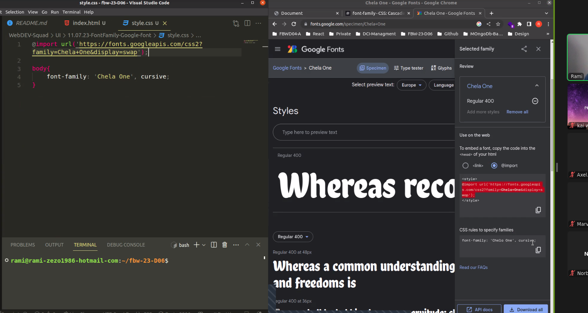
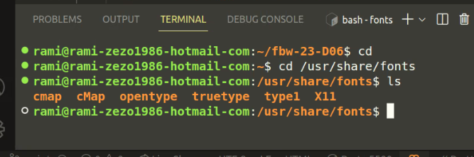
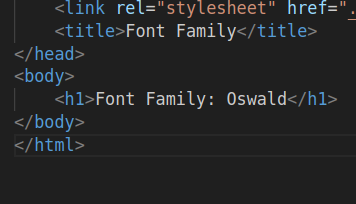
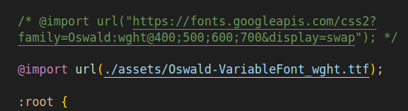
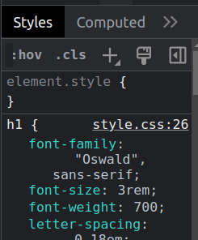

# Font Family



## Google Fonts lokal installieren:



```bash
cd /usr/share/fonts
sudo mkdir googlefonts
sudo unzip -d ./googlefonts ~/Downloads/"Deine Schrift".zip
cd ..
sudo chmod -R --reference=opentype googlefonts
# Schrift registrieren:
sudo fc-cache -fv
# ist sie installiert?
fc-match "Deine Schrift"
```

## Google Fonts zum Projekt hinzufügen:







