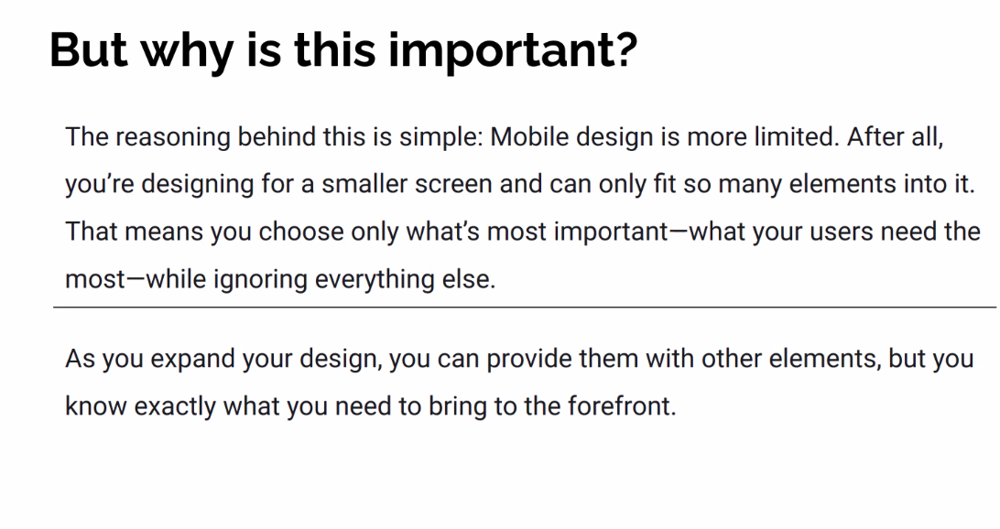

# Mobile-first Design





## Keep. The. User. In. Mind.

# Live Session:

#### CSS - Reset:


### Normalize.css:


https://necolas.github.io/normalize.css/8.0.1/normalize.css

oder:

```html
<link
      rel="stylesheet"
      href="https://cdnjs.cloudflare.com/ajax/libs/normalize/8.0.1/normalize.css"
    />
```

oder: 

```bash
mpm install normalize.css
```

#### dann entweder extern laden oder, besser, lokal instllieren und ansprechen:


