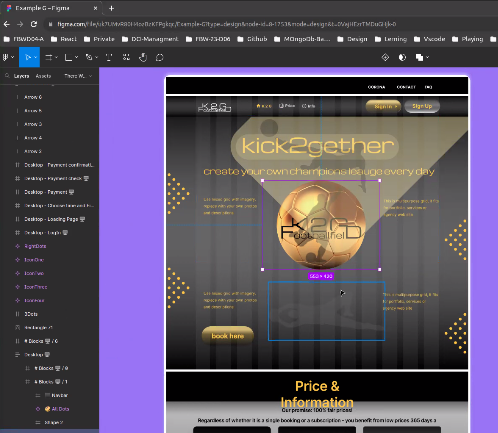
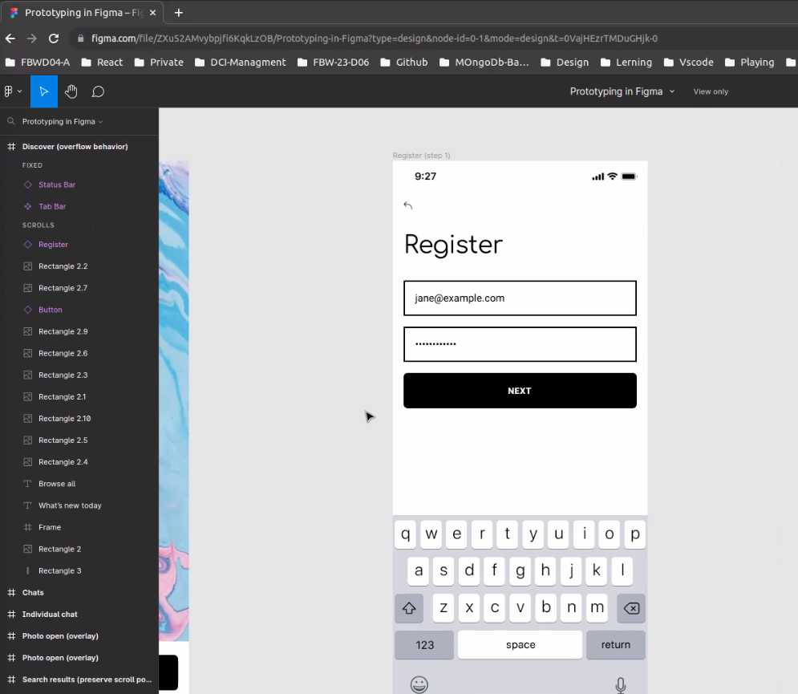

# Dienstag 08.08.23

- Planning our layout (Figma, Excalidraw)

- Flex Box

- Aligning and justifying

- Direction and wrapping

_Note:_ [Figma](https://www.figma.com/)

_Note:_ [Excaildraw](https://excalidraw.com/)

_Note:_ [Flex Box](https://css-tricks.com/snippets/css/a-guide-to-flexbox/)

# Flexbox

## flexbox immer Parent Element geben (main container)

### Unterschied align-items align-content:

align-content: center

Zusammengefasst zielt der Selektor .container > \* auf alle direkten Kinder-Elemente eines Elements ab, das die Klasse "container" hat. Das können z.B. Text, Bilder, Listen oder andere HTML-Elemente sein, die direkt innerhalb des "container"-Elements geschachtelt sind.
