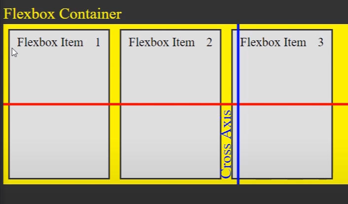
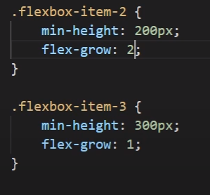
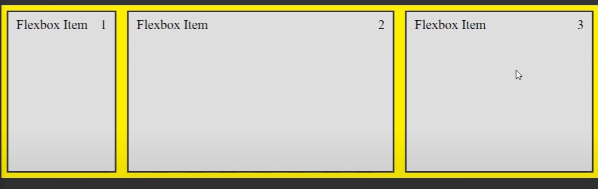

# Dienstag 08.08.23

- Planning our layout (Figma, Excalidraw)

- Flex Box

- Aligning and justifying

- Direction and wrapping

_Note:_ [Figma](https://www.figma.com/)

_Note:_ [Excaildraw](https://excalidraw.com/)

_Note:_ [Flex Box](https://css-tricks.com/snippets/css/a-guide-to-flexbox/)

# Flexbox

## flexbox immer Parent Element geben (main container)

### Unterschied align-items align-content:

align-content: center

Zusammengefasst zielt der Selektor .container > \* auf alle direkten Kinder-Elemente eines Elements ab, das die Klasse "container" hat. Das können z.B. Text, Bilder, Listen oder andere HTML-Elemente sein, die direkt innerhalb des "container"-Elements geschachtelt sind.

---

# Mittwoch 09.09.2023

## Flexbox

Justify Content - horizontal

Align Items - vertikal


#### Flex Wrap (Parent Container):

```css
.container {
  display: flex;
  flex-wrap: wrap; /* You can use 'nowrap', 'wrap', or 'wrap-reverse' */
}

/* In this example, the flex container with the class container will have its flex items wrapped onto multiple lines if necessary, due to the flex-wrap: wrap; rule. This can be particularly useful for creating responsive layouts where items should reorganize themselves when the available space changes. */
```

##### Child Items:

- flex-grow:

In this example, the flex container with the class container will have its flex items wrapped onto multiple lines if necessary, due to the flex-wrap: wrap; rule. This can be particularly useful for creating responsive layouts where items should reorganize themselves when the available space changes:

```css
.container {
  display: flex;
}

.item {
  flex-grow: 1; /* This item will grow to take up available space */
}
```

> If one item has flex-grow: 2 while another has flex-grow: 1, the first item will receive twice as much of the available space compared to the second item.





