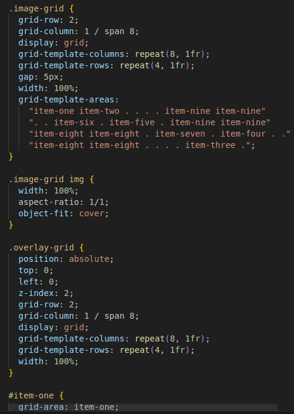

https://excalidraw.com

2023-08-21


---

### grid-template ist shortcut für

```css
grid-template-columns: repeat(8, 1fr);
grid-template-rows: repeat(4, 1fr);
```


### Beispiel:

```css
.image-grid {
  grid-row: 2;
  grid-column: 1 / span 8;
  display: grid;
  grid-template-columns: repeat(8, 1fr);
  grid-template-rows: repeat(4, 1fr);
  gap: 5px;
  width: 100%;
  grid-template-areas:
    "item-one item-two . . . . item-nine item-nine"
    ". . item-six . item-five . item-nine item-nine"
    "item-eight item-eight . item-seven . item-four . ."
    "item-eight item-eight . . . . item-three .";
}

#item-one {
  grid-area: item-one;
}

#item-two {
  grid-area: item-two;
}

#item-three {
  grid-area: item-three;
}
```



