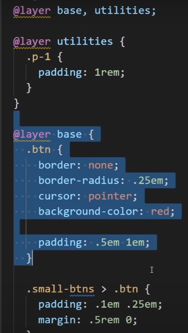

# Tailwind, Bootstrap, flowbite


## Tailwind


### [avoid code duplication by creating reusable components](https://youtu.be/mr15Xzb1Ook?si=D4tbl-2Ix6DLSEar)


```bash
# node version management installieren, falls nicht vorhanden:
curl -o- https://raw.githubusercontent.com/nvm-sh/nvm/v0.35.3/install.sh | bash
# falls Curl nicht installiert:
sudo snap install curl
# danach
command -v nvm
# = ist nvm installiert?

nvm install 16.8.0

nvm use 16.8.0

#Tailwind installieren:
npm install -D tailwindcss
npx tailwindcss init

#package.json kreieren:
npm init


content: ["./src/**/*.{html,js}"],

npx tailwindcss -i ./src/input.css -o ./dist/output.css --watch

```


---


### browser style sheet < @layer base < utilities < code aoutside layers



mit erster Zeile wird importance
