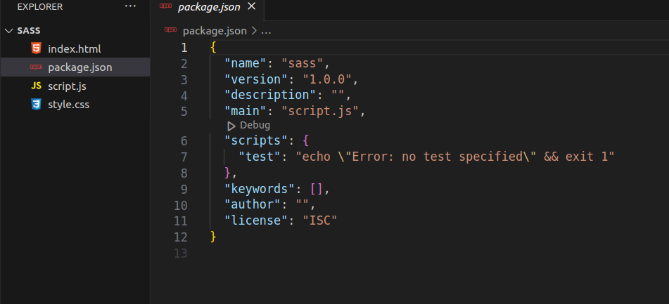
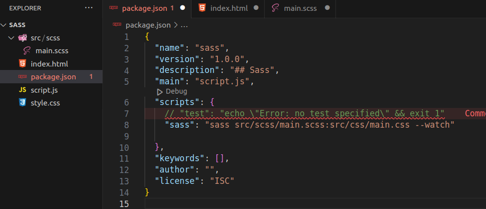
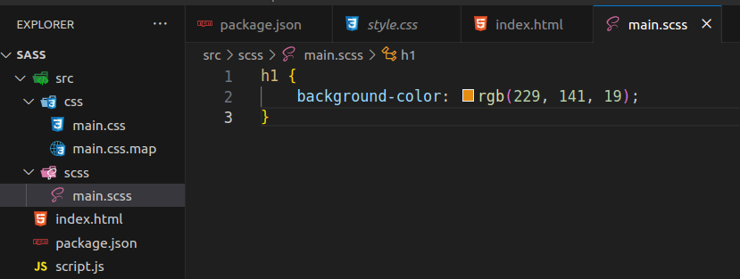
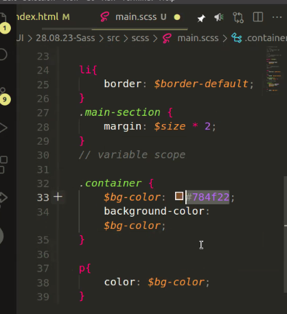

# SASS

```bash
npm i -g sass
# sass global installieren

npm init -y
# node_modules initialisieren
```

sollte ergeben:



### package.json / scripts:

```bash
  "scripts": {
    "test": "echo \"Error: no test specified\" && exit 1"
  },
# customize: automatisiert scripte ablaufen lassen.
```

### installieren (im Projekt):

```bash
npm i sass
# dann sieht man node_modules im project folder
```

### npm root -g:

zeigt, wo die global modules installiert sind.


---

## SCSS - nötige Ordner + Dateien:

```bash
mkdir src && mkdir src/scss && cd src/scss
touch main.scss
```

### Skript anpassen (package.json) = Pfad von scss to css definieren:



```json
  "scripts": {
    // "test": "echo \"Error: no test specified\" && exit 1"
    "sass": "sass src/scss/main.scss:src/css/main.css --watch"

  },
```

### index.html anpassen:

```html
<link rel="stylesheet" href="./src/css/main.css" />
```

---

### Terminal: sass starten mit..

```bash
npm run sass
# sass beenden mit ^C (= CTRL + C)
```

### ..dann werden die in main.css vorgenommenen Änderungen übertragen in style.css:




## Variablen in Sass

Beispiel:

```css
/* normales css:*/
:root {
  --primary-color: rgb(229, 141, 19);
  --secondary-color: rgb(255, 255, 255);
  --tertiary-color: rgb(0, 0, 0);
}

/* SASS: 
 variables in sass fangen mit "$" an, da kann man sie definieren */
$bg-color: rgb(229, 141, 19);

$primary-color: rgb(229, 141, 19);
$secondary-color: rgb(255, 255, 255);
$tertiary-color: rgb(0, 0, 0);

/* Definieren in _variables.scss
 dann 
 _variables.scss importieren in main.scss: */
@import "variables";
```


## Variable Scope:




- nur für den .container


- globale Variable
