# JS


### damit console.log im Terminal funktioniert:

```bash
# npm install -g npm@latest
npm -i node
```

## Data Types:

### arrays

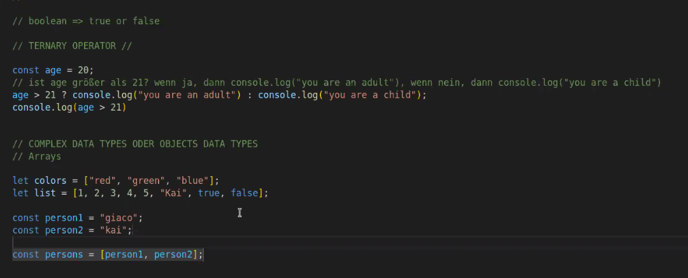

Beispiel für arrays:

- You Tube Video Liste
- Liste von WhatsApp Nachrichten

### function (=object type)

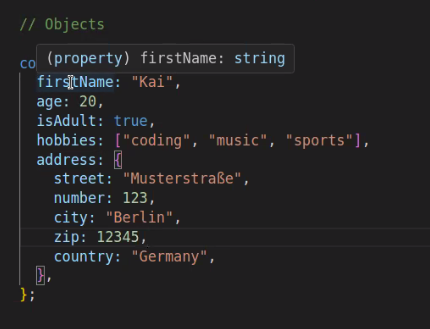

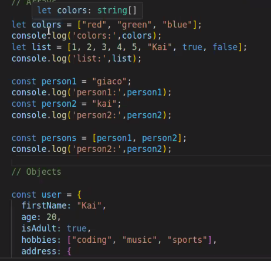

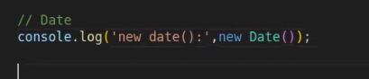

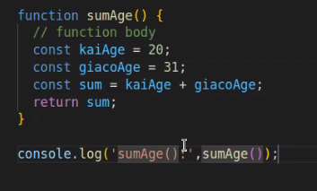

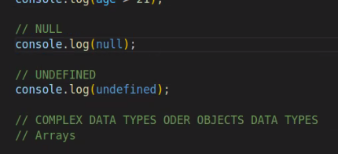

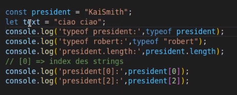

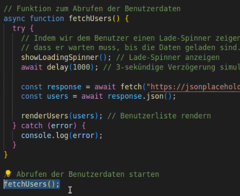

async functions: man folgt nicht zwingend der Top to Bottom order

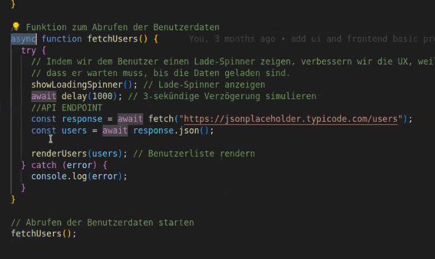

### Konstanten ändern:

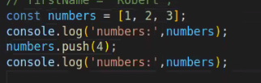

mit push kann man neue data types zu einem array hinzufügen

```javascript
const array = [1, 2, 3, 4, 5];
array.push(6);
console.log(array);
```

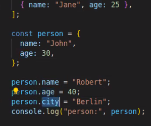

[Unterschied var - let - const](./var-let-const.md)

---

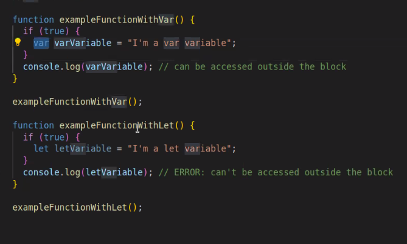
