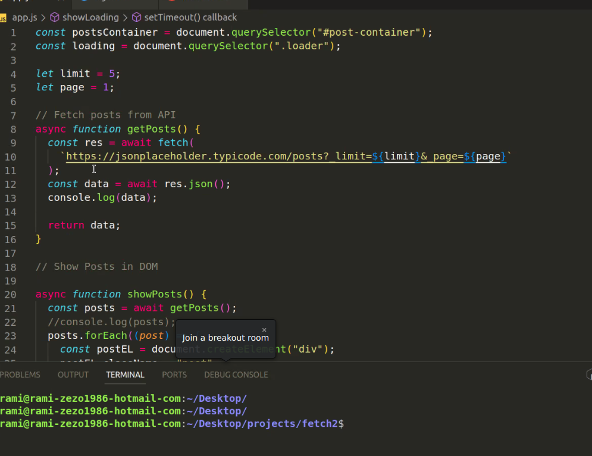

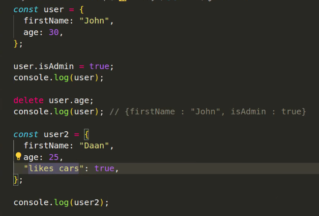

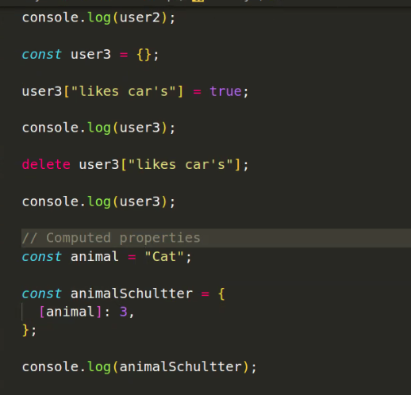
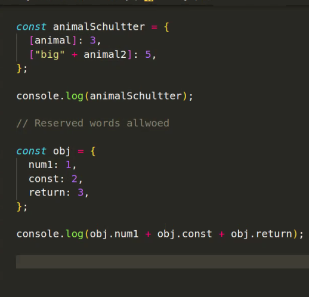

## ??????

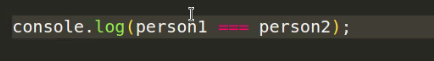

## heap and stack checken..

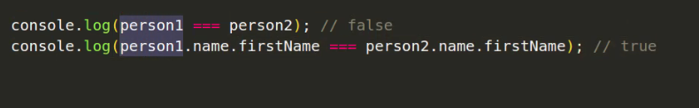

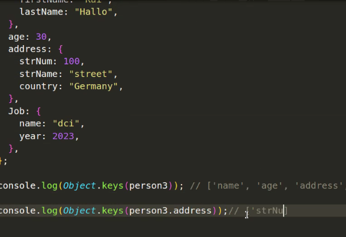

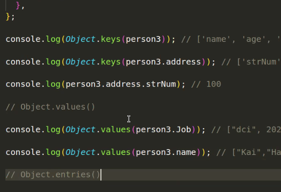

## bracket notation gibt entweder key oder value aus:

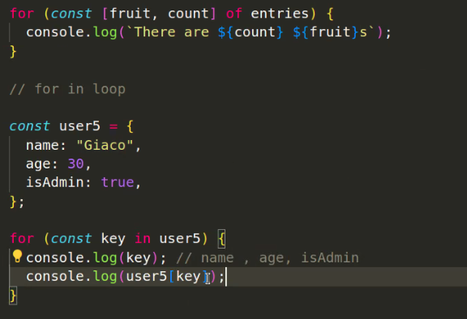

### andere Schreibweise:

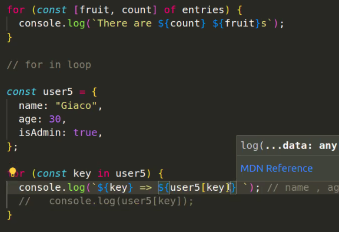

### index:

### .dot notation:

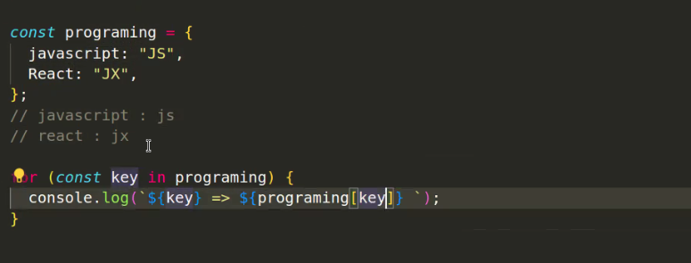

### bracket notation:

##### (geht nur mit STRING)

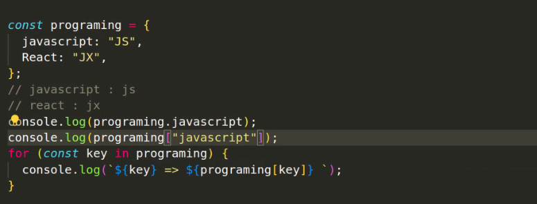

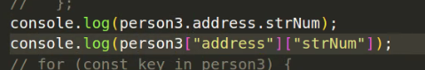

## bonus task letzte woche:

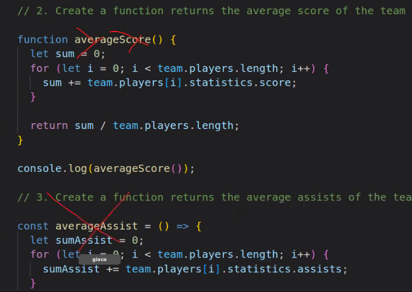
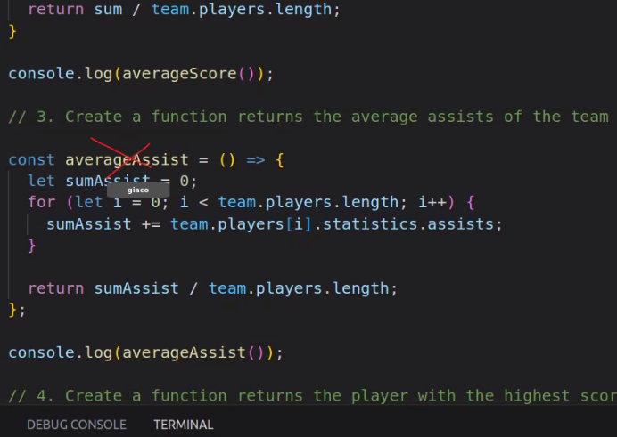
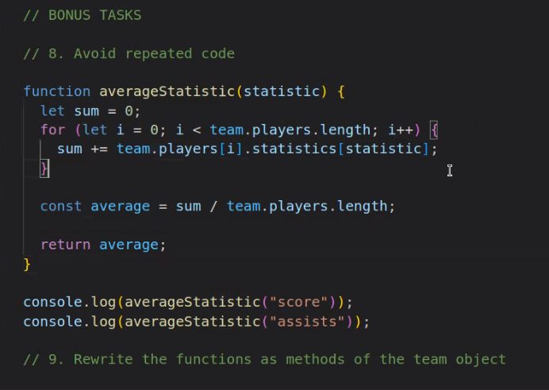

## aufgaben:

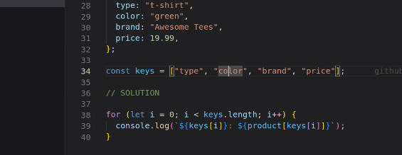
