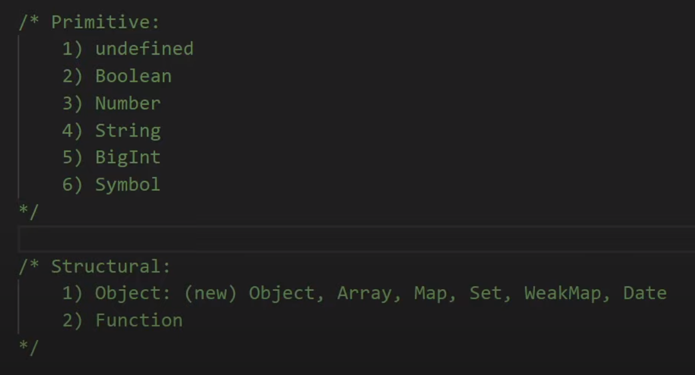
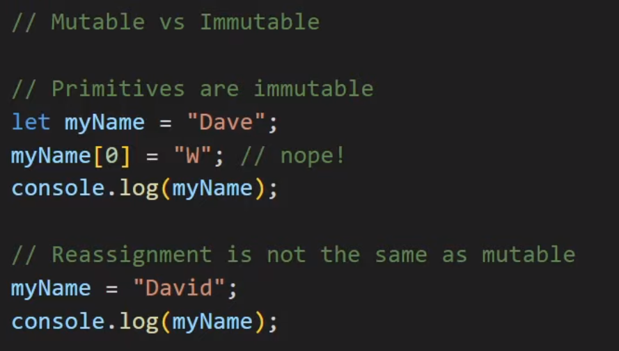
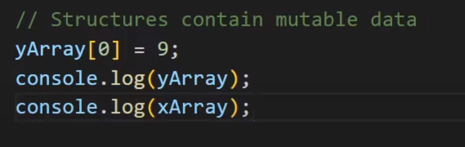
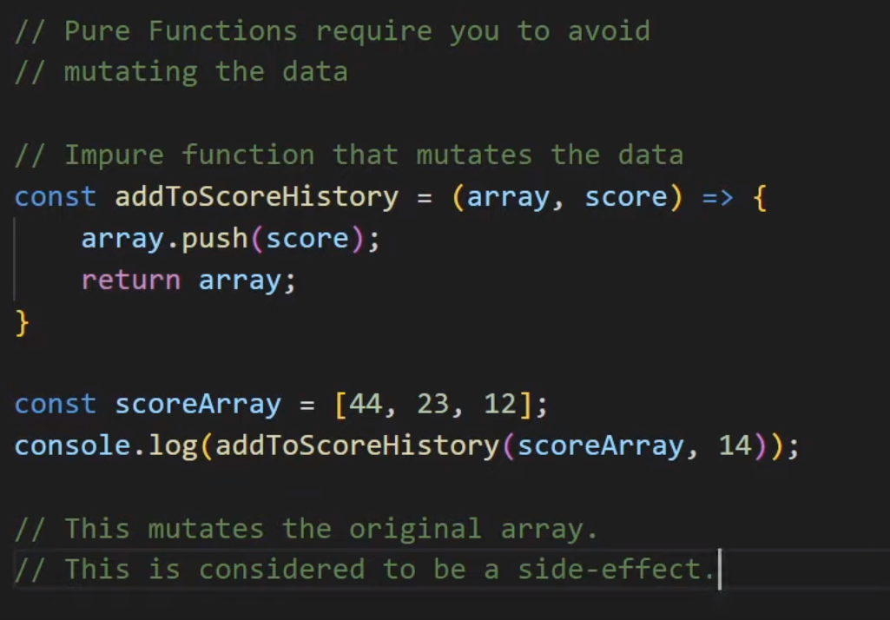
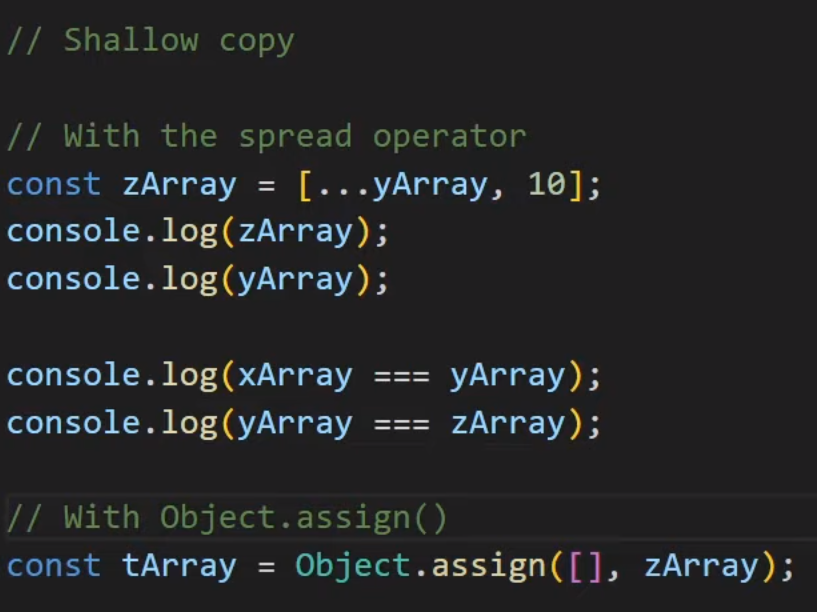
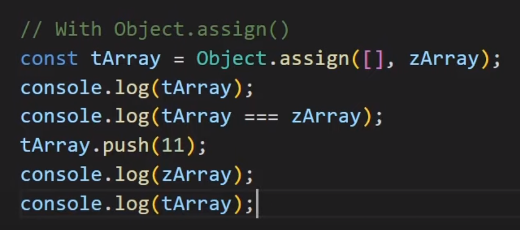

# Object clone and destructuring

## shallow copy vs. deep copy

> Video: https://youtu.be/4Ej0LwjCDZQ

### .js Data Types - Primitive vs Structural



- primitive data types pass values

```js
// z.B.
let x = 1;
```

- structural data types pass references

```js
// z.B.
let xArray = [1, 2, 3];
```

- primitive data types are immutable - you can reassign them, though..



- structural data types are mutable - you can change them



- pure functions do not mutate data. Impure functions do.



### Shallow copy vs. deep copy

- shallow copy - doesn't change the original array. This can be provided by using the SPREAD OPERATOR:



- "clone", that's independent, using Object.assign:



### use deep copy to avoid mutating data
