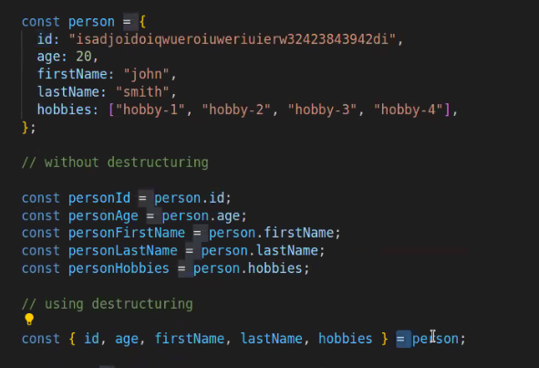
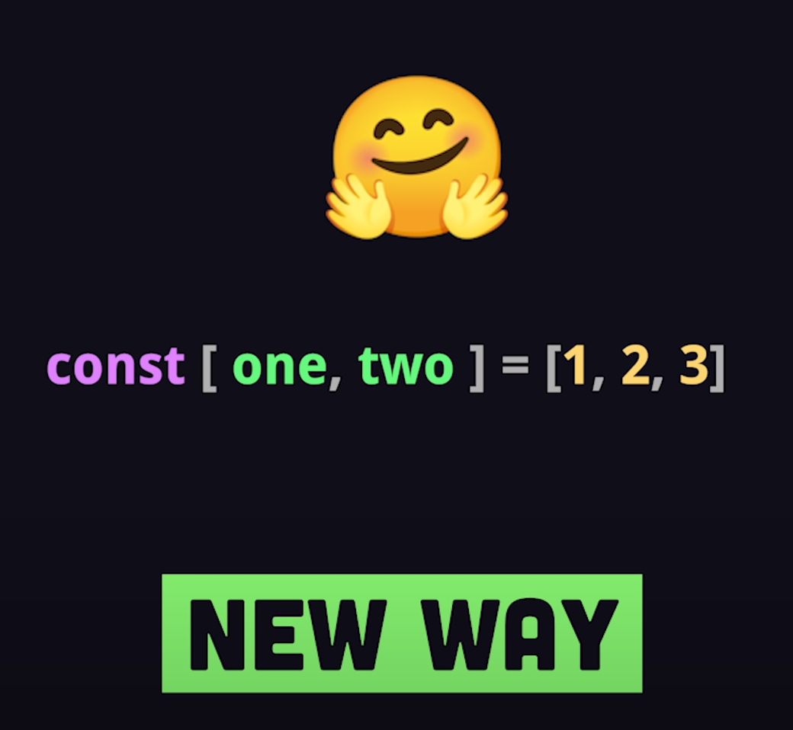
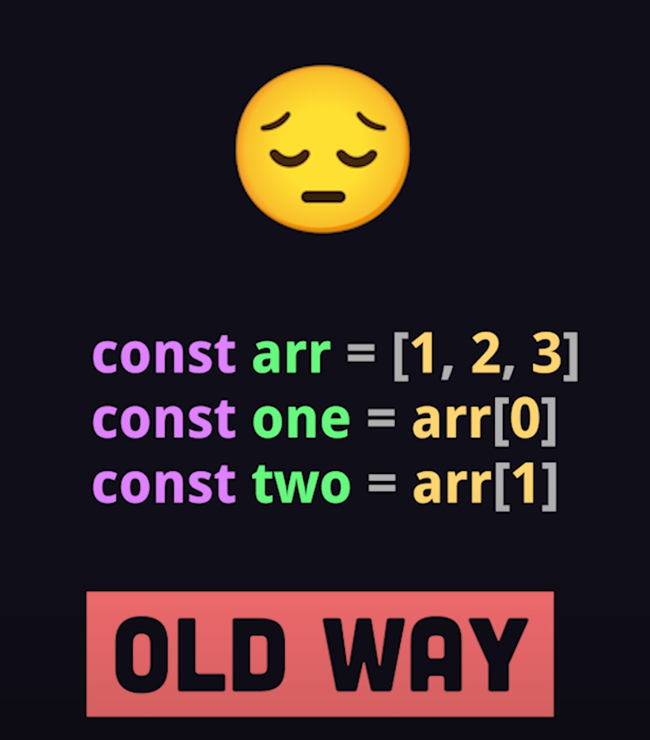

# DEEP CLONONG vs. SHALLOW CLONING


```js
let h = JSON.parse(JSON.stringify(g));
g.address.city = "Hamburg";
```

- json stringify:

ist eine methode - verwandelt javascript object in json string

```js
function deepClone(reference) {
  return JSON.parse(JSON.stringify(reference));
}
```

# destructuring





