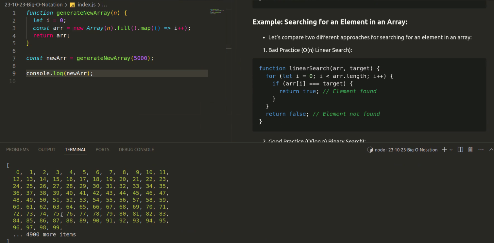
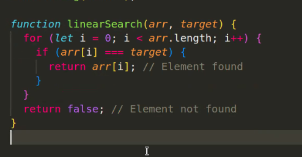
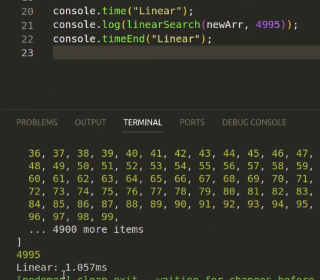
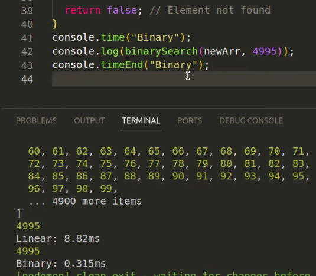
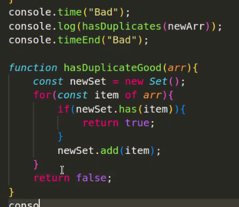

# Big O notation

generate arry with 5000 items:



### linear search:



Zeit messen mit built-in Methode:



### binary search:

```javascript
function binarySearch(arr, target) {
  let low = 0;
  let high = arr.length - 1;
  while (low <= high) {
    let mid = Math.floor((low + high) / 2);
    if (arr[mid] === target) {
      return mid;
    } else if (arr[mid] < target) {
      low = mid + 1;
    } else {
      high = mid - 1;
    }
  }
  return -1;
}
```

Unterschied linear sesarch / binary search:



find duplicates:



..also nested loops vermeiden aus performance Gründen.
