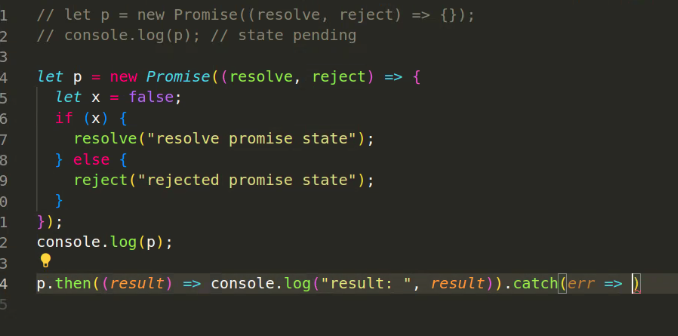
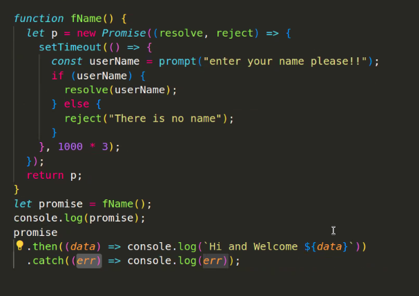
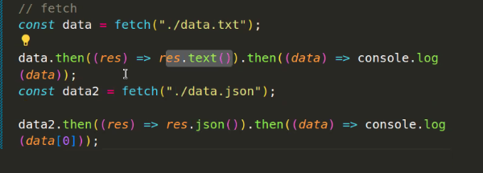

# Promises



### recap: "chaining", z.B.:

```js
p.then((result) => console.log("result: ", result))
  .catch((error) => console.log("error: ", error))
  .finally(() => console.log("finally"));
```

Promises: idea to handle asynchronous Code.



Fetch:

