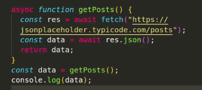

# JSON:

## JSON.stringify(), JSON.parse(), fetch(), localStorage, sessionStorage

## [W3 JSON Tutorial](https://www.w3schools.com/js/js_json_intro.asp)

- **wenn wir Daten schicken, muss es ein String sein, kein Object --> deshalb konvertieren zu string (m. stringify) für local storage.**
  <br> _(Local Storage kann nur strings speichern.)
  <br> Dies geschieht mit `JSON.stringify()`._

- **mit fetch erhalten wir Daten in Form von JSON, das wir in JS Objekte konvertieren müssen (m. parse).**
  <br> _Wenn man Daten über `fetch()` erhält, sind diese oft im JSON-Format. <br>Um sie in JavaScript als Objekte zu verwenden, muss man sie mit `JSON.parse()` umwandeln._

- **JSON ist ein Format, das Daten in Form von Objekten und Arrays darstellt.**
  <br> _JSON (JavaScript Object Notation) ist ein Format, das zur Darstellung von Daten verwendet wird, und kann Objekte, Arrays, Strings, Zahlen und andere Datenformate enthalten._

- **JSON ist ein String, der wie ein Objekt aussieht.**
  <br> _JSON ist ein Textformat, das so strukturiert ist, dass es Objekt- oder Array-ähnliche Strukturen repräsentiert. <br> JSON selbst ist nur ein String und wird erst durch das Parsen in ein echtes JavaScript-Objekt umgewandelt._

- **JSON ist ein Textformat, das für die Kommunikation zwischen Frontend und Backend verwandt wird.**

`


JSON verwandt zur Kommunikation zwischen Frontend und Backend.

## Stringify und Parse:

### `JSON.stringify()` --> konvertiert JS Objekte in JSON.

> **Syntax:** `JSON.stringify(object)`

### `JSON.parse()` --> konvertiert JSON in JS Objekte.

> **Syntax:** `JSON.parse(json)`

##### Beispiele:

```js
// stringify:
// The JavaScript built-in function
// JSON.stringify()
// converts JavaScript objects into JSON-strings.

const person = {
  name: "John",
  age: 20,
  isStudent: true,
  courses: ["Math", "IT", "English"],
  address: {
    street: "Hauptbahnhof",
    city: "Hamburg",
    zipcode: "22111",
  },
};

const personJSON = JSON.stringify(person);

// parse:
// The JavaScript built-in function
// JSON.parse()
// converts JSON-strings into a JavaScript objects.

const personObject = JSON.parse(personJSON);
```

- single quotes werden in double quotes konvertiert
- Objekte werden in geschweiften Klammern konvertiert
- Arrays werden in eckigen Klammern konvertiert
- Strings werden in double quotes konvertiert
- Zahlen werden nicht konvertiert
- Boolean werden nicht konvertiert
- Null wird nicht konvertiert

```js
let numbersArray = [1, 2, 3, 4, 5];
let obj = '{"num": 1, "num2": 2}';
```

---

## localStorage:

- `localStorage` ist ein Web Storage-Option, um Daten auf der Client-Seite zu speichern. <br> Ermöglicht Webanwendungen, Daten lokal innerhalb des Browsers zu speichern.
- `localStorage` bleibt über Browser-Sitzungen hinweg bestehen und bleibt auch dann zugänglich, wenn der Benutzer den Browser schließt und erneut öffnet.
- `localStorage` bleibt bis zur expliziten Löschung durch den Benutzer oder die Webanwendung bestehen.
- `localStorage` ist ein Objekt, das in der globalen `window`-Umgebung verfügbar ist.


## sessionStorage:

- `sessionStorage` speichert ebenfalls Daten auf Client-Seite. <br>
- `sessionStorage` bleibt nur für die Dauer der Seitensitzung bestehen. <br>
- `sessionStorage` ist tab - spezifisch: wird gelöscht, wenn Tab oder Fenster geschlossen werden. <br>
- `sessionStorage` eignet sich besonders für die Speicherung von Daten, die nur vorübergehend während einer einzelnen Sitzung benötigt werden, z.B. user preferences für eine bestimmte Sitzung oder Zustand einer SPA während der Navigation.

---

<br>

# Fetch:

- `fetch()` ist eine Methode, die den Prozess des Abrufens von Ressourcen von einem Server startet. Sie gibt ein Promise zurück, das sich in die Antwort auf diese Anfrage auflöst.

- ### [Fetch - Workflow](./fetch-workflow.md)

## async/await: alternative Syntax für Promises

`async`/`await` ist eine alternative Syntax für Promises. Sie ist einfacher zu lesen und zu schreiben als die `then()`-Syntax.



```javascript
async function getData() {
  try {
    const response = await fetch("https://api.example.com/data");
    const data = await response.json();
    console.log(data);
  } catch (error) {
    console.error("There has been a problem with your fetch operation:", error);
  }
}
```
