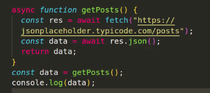

# `fetch` - Workflow in JavaScript

`fetch` ist eine moderne Methode in JavaScript, um Netzwerkanfragen durchzuführen. Hier ist der grundlegende Workflow:

## 1. Anfrage senden

Zunächst wird `fetch` mit einer URL und optionalen Konfigurationsoptionen aufgerufen.

```javascript
fetch("https://api.example.com/data", {
  method: "GET", // oder 'POST', 'PUT', 'DELETE', etc.
  headers: {
    "Content-Type": "application/json",
    // Weitere Header
  },
  // body: JSON.stringify(data) // Für POST oder PUT Anfragen
});
```

## 2. Antwort empfangen

`fetch` gibt ein Promise zurück, das sich in die Antwort auf die Anfrage auflöst. Die Antwort ist ein `Response`-Objekt, das Informationen über die Antwort enthält, z.B. den Statuscode, die Header und den Body.

gibt ein Promise zurück, das sich auflöst, sobald eine Antwort vom Server empfangen wird.

```javascript
fetch("https://api.example.com/data").then((response) => {
  // Hier kann die Antwort verarbeitet werden
});
```

## 3. Verarbeitung der Antwort

Die Antwort muss typischerweise in ein nützliches Format konvertiert werden.

Dazu gibt es verschiedene Methoden, z.B. `json()`, `text()`, `blob()`, `arrayBuffer()` oder `formData()`.

```javascript
.then(response => {
  if (!response.ok) {
    throw new Error('Network response was not ok');
  }
  return response.json(); // oder response.text(), response.blob(), etc.
})
```

## 4. Verwendung der Daten

Nachdem die Antwort verarbeitet wurde, können die Daten in der Anwendung verwendet werden.

```javascript
.then(data => {
  console.log(data); // Verarbeitete Daten
})
```

## 5. Fehlerbehandlung

Wenn ein Fehler auftritt, wird das Promise abgelehnt. Dies kann mit der `catch()`-Methode behandelt werden.

```javascript
.catch(error => {
  console.error('There has been a problem with your fetch operation:', error);
});
```

---

## async/await: alternative Syntax für Promises

`async`/`await` ist eine alternative Syntax für Promises. Sie ist einfacher zu lesen und zu schreiben als die `then()`-Syntax.



```javascript
async function getData() {
  try {
    const response = await fetch("https://api.example.com/data");
    const data = await response.json();
    console.log(data);
  } catch (error) {
    console.error("There has been a problem with your fetch operation:", error);
  }
}
```
