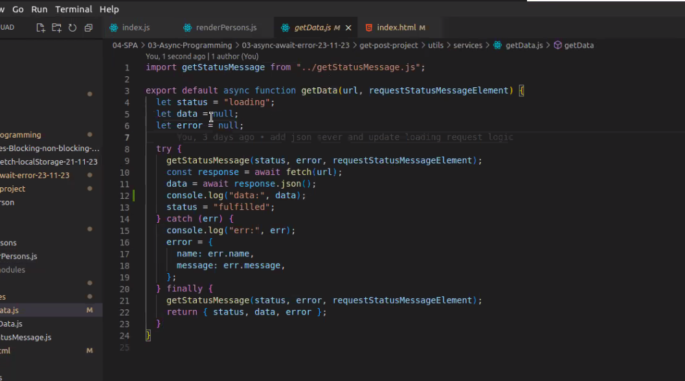
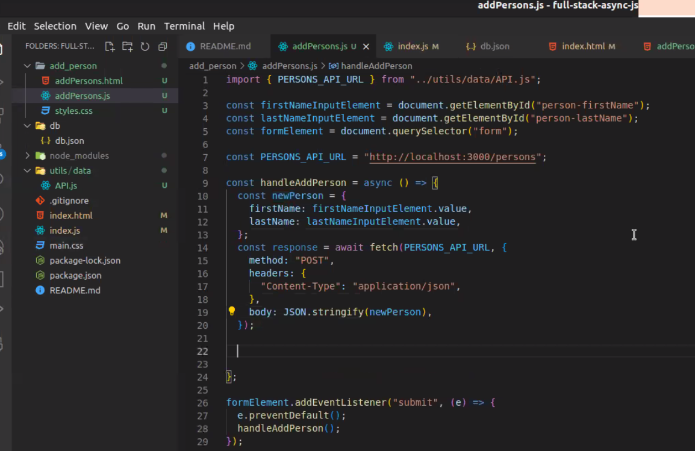
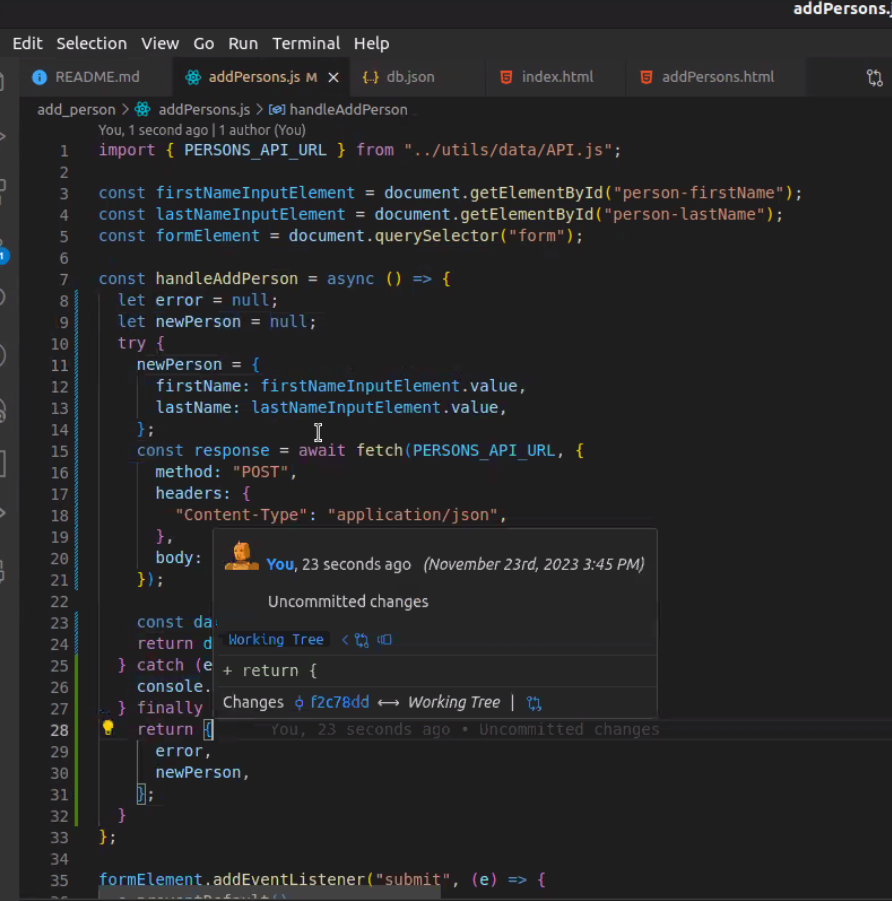
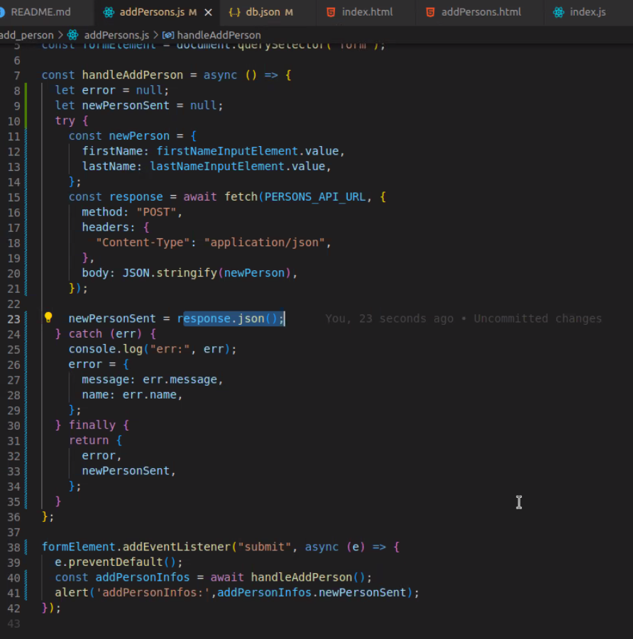

# Get - Post - Project

functions exportieren, damit sie als snippets importiert werden können..

### [JSON Server Tutorial](https://www.youtube.com/watch?v=1zkgdLZEdwM)

### [JSON Server Documentation](https://www.npmjs.com/package/json-server#getting-started)

