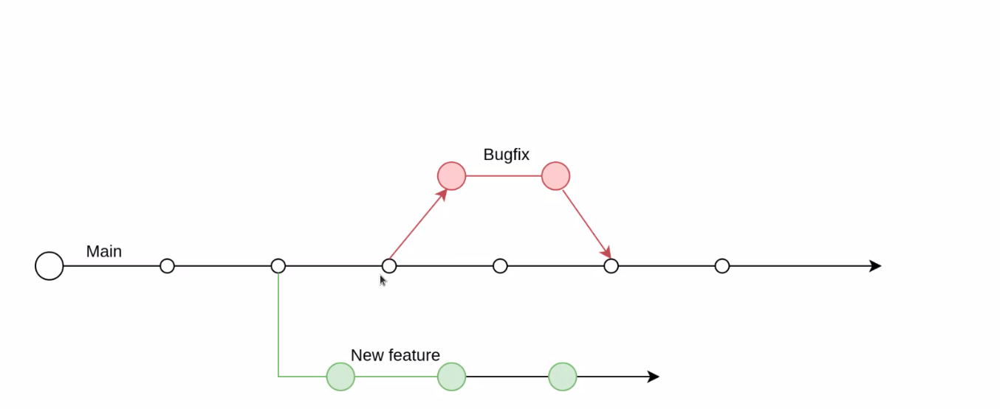
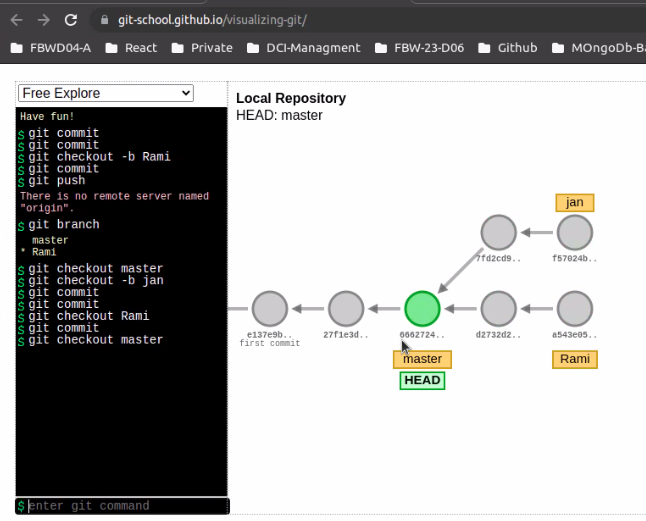

# github: Branching



#### [Visualizing Git](https://git-school.github.io/visualizing-git/)



### Setup

```bash
git merge branch1
```

---

### Wo bin ich?

```bash
git branch
```

### Create Branch

```bash
git branch -b jan
# Syntax:git branch -b <name>
```

### auf diesen Zweig wechseln:

```bash
git checkout jan
# Syntax:git checkout <branch-name>
```

### Shorthand for both of the above:

```bash
git checkout -b jan
# Syntax: git checkout -b branch-name
# create branch && change branch
#
```

### Jan bearbeitet, committed, merged mit master:

```bash
git checkout -b jan
git commit
# fertig mit bearbeiten. dann
git merge master
```

### Lokales Repository erzeugen

> git checkout branchnameany folder, darin

```git
git checkout -b
```

### Bin ich in einem git repository?

```git
git status
```

### Womit bin ich verbunden?

```git
git remote -v
```

#### view comments

```git
git log
```

#### Zurückgehen zu previous version / Back to master (= main branch)

```git
git checkout <hash> / git checkout master
```

#### Lokale Datei auf github pushen:

```git
git add .
git commit -m update
git push
```
