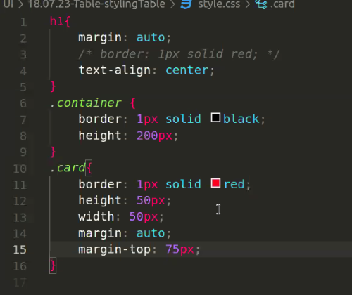
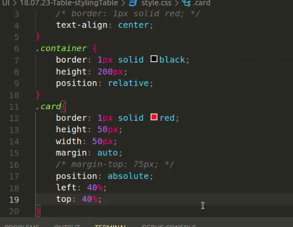
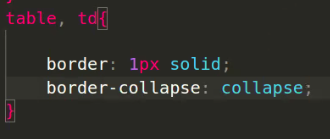
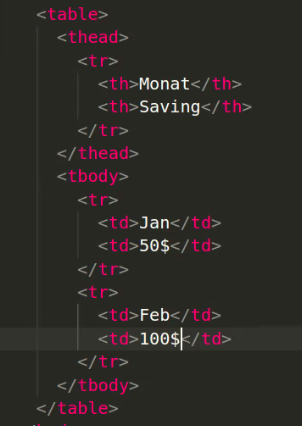
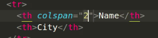
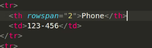
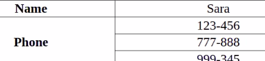
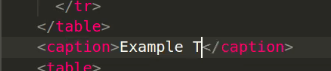
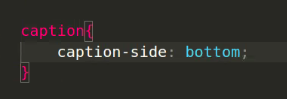
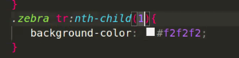

## PARENT relative, CHiLD absolute


---

# Tables

tr = tablerow
td = table data
thead, th
















th colspan="2" scope="" (??)



tr:nth

```css
/* Wähle jeden dritten Benutzer ab dem vierten Benutzer aus */
tr:nth-child(3n+4) {
  /* Deine Stilregeln für die ausgewählten Benutzer hier einfügen */
}

```