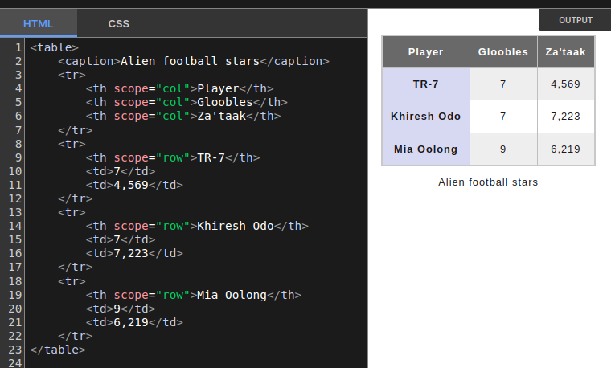
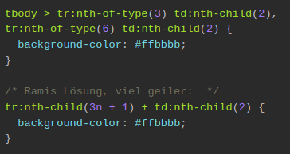

## PARENT relative, CHiLD absolute


---

# Tables

tr = tablerow
td = table data
thead, th


th colspan="2" scope="" (??)


tr:nth

```css
/* Wähle jeden dritten Benutzer ab dem vierten Benutzer aus */
tr:nth-child(3n + 4) {
  /* Deine Stilregeln für die ausgewählten Benutzer hier einfügen */
}
```



aus [MDN](https://developer.mozilla.org/en-US/docs/Web/HTML/Element/tr)



```css
tbody > tr:nth-of-type(3) td:nth-child(2),
tr:nth-of-type(6) td:nth-child(2) {
  background-color: #ffbbbb;
}

/* Ramis Lösung, viel geiler:  */
tr:nth-child(3n + 1) + td:nth-child(2) {
  background-color: #ffbbbb;
}
```
