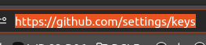
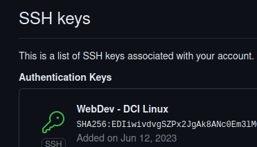
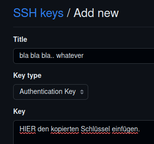
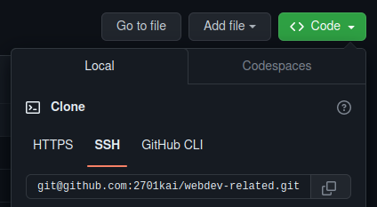

# SSH Key installieren

### Terminal:

```bash
cd ~/.ssh
# falls Ordner ".ssh" nicht vorhanden:
# cd
# mkdir .ssh
# dann cd ~/.ssh
ssh-keygen -t rsa -C deine-adresse@xy.com
eval "$(ssh-agent -s)"
ssh-add ~/.ssh/id_rsa
cat ~/.ssh/id_rsa.pub
# SSH Key kopieren, damit auf Deinen github Account wechseln..
```

#

## SSH Key in GitHub hinzufügen:

### [Dein GitHub - Account](https://github.com/settings/keys)

###



##



##




#

#### Hurra, fertig!

ab jetzt kannst Du bequem im VS Code Terminal Repos runterladen.
Einfach Code kopieren:



###

und

###

```bash
cd # in Deinen Lieblingsordner, wo Du lokal Code / Repos speicherst, darin
git clone git@github.com:xyz/remoteRepoName.git
```
