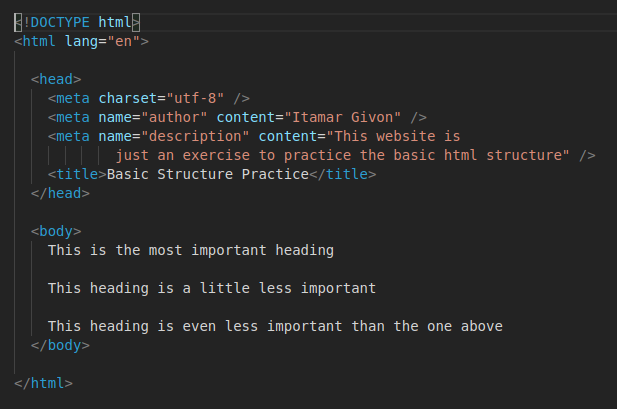

# Basic Structure

Practice basic HTML editing

## What you will be doing

In this exercise you create a HTML file based on an example image.

### Example

## Tasks

### Task 1

- Create a file named `index.html`
- Create a basic html structure as shown in the example image
- Change the name in the author meta to your name
- Wrap each of the lines in the `<body>` it in the appropriate heading
- For each heading add a **hover tooltip** that displays which element it is
- Add a comment to explain each html element in the document
- For each heading add a paragraph below it, with any text you would like, and add a comment to the first `
` tag explain what it is.

### Task 2

- Using a `pre` tag add the text from the following [file](/assets/logo.txt) into your html page so that it looks like it does in the file.