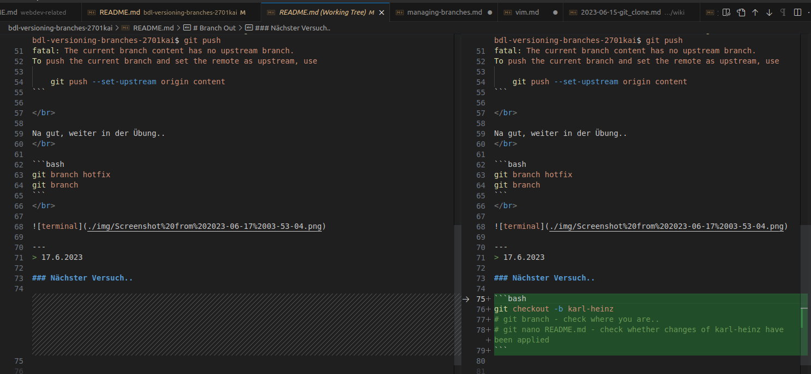

# Branch Out

**Instructions**
* Create a new repository locally. 
* Add a readme file to the master branch. Add a heading to file. Make sure to add, commit your changes. 
* Create a branch named `content` and switch to the new branch.
* Add text to the readme file on the `content` branch. Don't forget to add and commit these changes.
* Go back to master and create another branch named `hotfix` from master. Note that the changes in your previous branch, `content`, are not there. 
* View all branches on terminal.

---

> VSCode Terminal:

<br />

```bash
mkdir branch-out
cd branch-out
# in meinem "code" Ordner erstellt, git init also nicht nötig..
touch README.md
git branch content
git checkout content
```

<br /> 
oder 
</br>

<br />

```bash
git checkout -b content
# shorthand, thanx Gaël!
```
</br>

> darin DIESE Veränderungen in der README erstellen. Danach das Übliche, `STRG +s`, danach `git commit -am update` und `git push`

<br />

Oh, es gab Fehlermeldung. Montag nochmal checken, es ist 3:48 Uhr, Antje bringt mich um..
</br>

```bash
dci-student@dciadmin-ThinkPad-L15-Gen-3:~/dci/code/bdl-versioning-branches-2701kai$ git add .
dci-student@dciadmin-ThinkPad-L15-Gen-3:~/dci/code/bdl-versioning-branches-2701kai$ git commit -m "myChanges"
On branch content
nothing to commit, working tree clean
dci-student@dciadmin-ThinkPad-L15-Gen-3:~/dci/git branchcode/bdl-versioning-branches-2701kai$ git push
fatal: The current branch content has no upstream branch.
To push the current branch and set the remote as upstream, use

    git push --set-upstream origin content
```

</br>

Na gut, weiter in der Übung..
</br>

```bash
git branch hotfix
git branch
```
</br>


---
> 17.6.2023

### Nächster Versuch..

new coworker karl-heinz entering the scene to solve the issues..
</br>

```bash
git checkout -b karl-heinz
# git branch - check where you are..
# git branch --remote - check out remote branches
# and where you are..
git branch --remote
# oops, -- vergessen, deshalb
git branch -D remote
git branch
# git nano README.md - check whether changes of karl-heinz 
# have been applied
# 
```
</br>

> verify by git graph extension:



danach

</br>

```bash
git push
# funktioniert nicht, deshalb
git push --set-upstream origin karl-heinz
# push local (karl-heinz) to remote
#
git commit -am update
# ah, untracked files.. therefor

git add .
git commit -m update
git push
```
</br>

danach
</br>

```bash
git checkout main
# switch to main

git merge karl-heinz
# to merge karl-heinz contibution into main
```
</br>
karl-heinz over, issues solved.
I guess.

---

### main again:

"thanx, karl-heinz."

---
