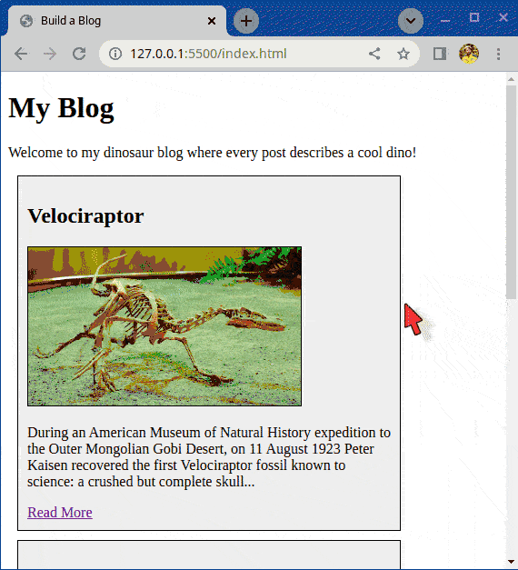

# Build a Blog

This exercise is about training images and links.

## What you will be doing

Your task is to build a little blog. The topic or theme of
your blog is free for you to choose, as an example we have
posts about different Dinosaurs. The content is not that
important for the exercise, but you can have fun with it!

### Example

Here's an example what a page like this might look like. You
don't have to copy it exactly, it's more like an
inspirational example. The images used in the demo are
includedin the `images` directory.

## Tasks

### Task 1

- Create a `posts` directory
- Inside the `posts` directory create at least three HTML pages for your posts
    - Call them `post-1.html`, `post-2.html`, `post-3.html`
    - Inside each individual post page, put
        - The main image
        - The title
        - The full article content (example form Wikipedia)
        - A 'return to homepage' link
        - Try to use as many things you learned as possible
            - Extra images, maybe a floating image in the text
            - Add background color
            - Add colored links
            - etc.

### Task 2

- Add the basic HTML5 boilerplate to `index.html`
- Add a list of the posts to `index.html` including
    - The main picture, title, and the first few lines of content
    - A "read more" link that points to the full blog post such as post-1.html