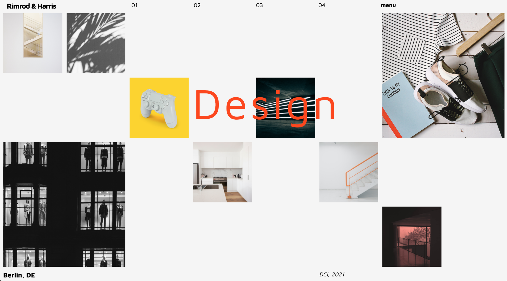

# Grid Design Studio

You've just been tasked with creating the new homepage for the _Rimrod & Harris_ design studio. Below is the mockup the designer just sent you for the site -

Looks like a job for **CSS Grid**, right?

#### Instructions

- Use the _Maven Pro_ font from **Google Fonts**
- Don't worry about responsivity at the moment - just concentrate on the desktop layout
- All images are located in the **assets** folder
- There are many ways to do this! A nested grid might be useful..
- Get as close to 'pixel perfect' as possible :)

[//]: # (autograding info start)
#  Results
> ⌛ Give it a minute. As long as you see the orange dot  on top, CodeBuddy is still processing. Refresh this page to see it's current status.
>
> This is what CodeBuddy found when running your code. It is to show you what you have achieved and to give you hints on how to complete the exercise.

### Markup

|                 Status                  | Check                                                                                    |
| :-------------------------------------: | :--------------------------------------------------------------------------------------- |
|  | `index.html` should contain appropriate meta tags |
|  | `index.html` Should contain a title tag that is not empty |
|  | Nav element Should be present on the page |

### Fonts

|                 Status                  | Check                                                                                    |
| :-------------------------------------: | :--------------------------------------------------------------------------------------- |
|  | Page Should contain 'Maven Pro' Google font |

### Styling

|                 Status                  | Check                                                                                    |
| :-------------------------------------: | :--------------------------------------------------------------------------------------- |
|  | Grid Layout should be used |
|  | Grid Template Columns CSS property Should be used |
|  | Grid Template Rows CSS property Should be used |
|  | Grid Column CSS property Should be used |

[🔬 Results Details](../../actions)
[🐞 Tips on Debugging](https://github.com/DCI-EdTech/autograding-setup/wiki/How-to-work-with-CodeBuddy)
[📢 Report Problem](https://docs.google.com/forms/d/e/1FAIpQLSfS8wPh6bCMTLF2wmjiE5_UhPiOEnubEwwPLN_M8zTCjx5qbg/viewform?usp=pp_url&entry.652569746=UIB-layout-grid-design-studio)

[//]: # (autograding info end)