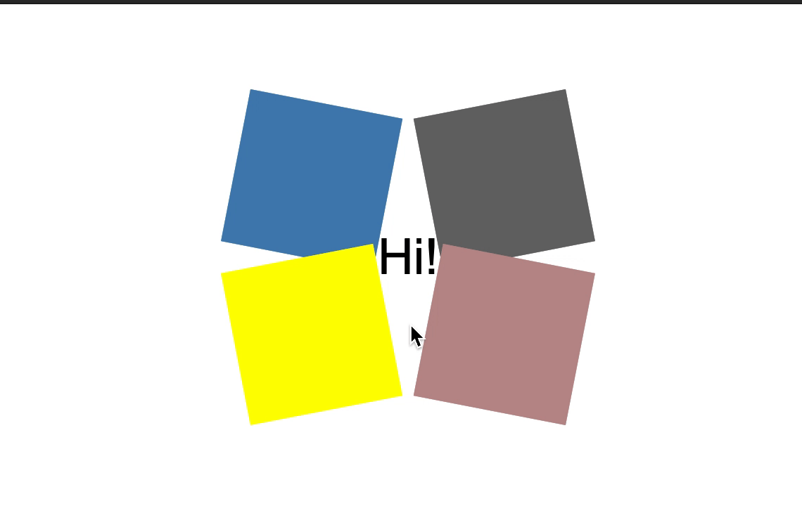

# ♪ Secret Unfolds

Erstelle eine Animation, die wie das unten gezeigte Beispiel funktioniert.

### Tipps

- `transform`

- `relative` und `absolute` Positionierung werden hier nützlich sein

- Wenn du die gleichen Farben wie im Beispiel verwenden willst, sind das `steelblue`, `dimgray`, `rosybrown`, `yellow`.

### Bonus!

- Versuche, die Animation zu verändern, indem du vier zusätzliche Kästchen hinzufügst

- Experimentiere mit `transition-delay`

Viel Glück und viel Spaß!
