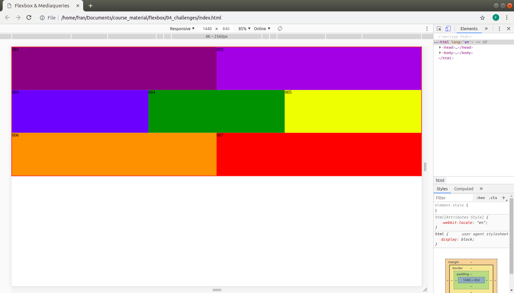
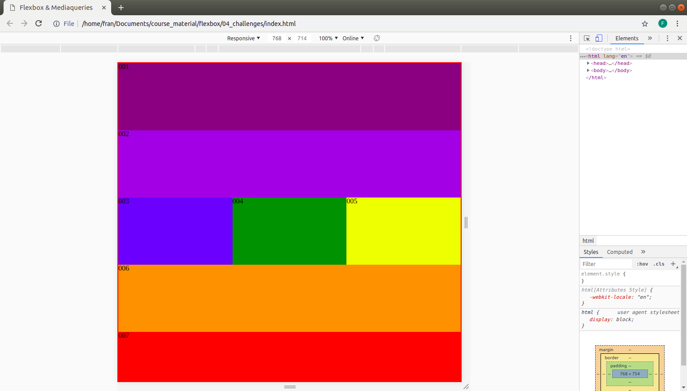
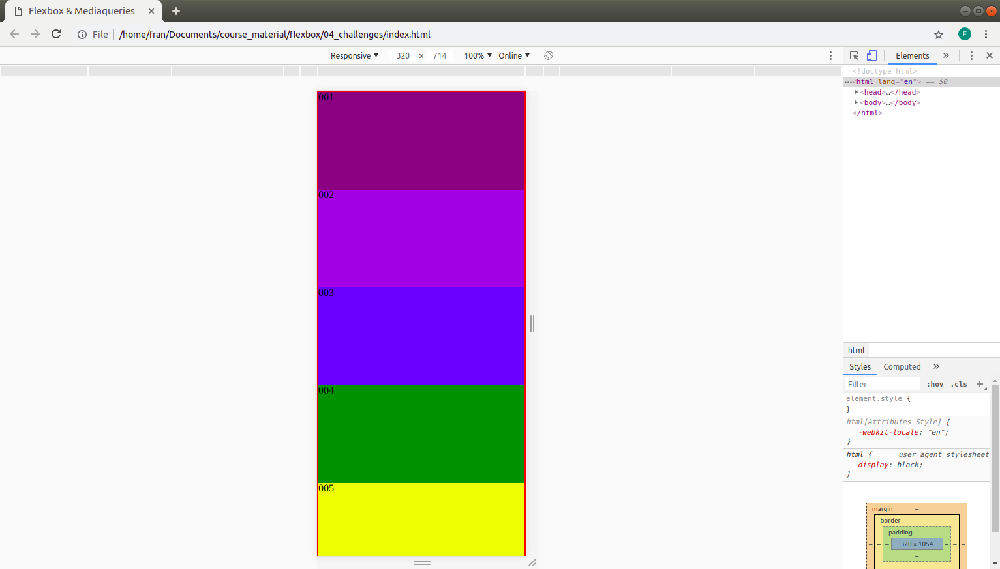

## Anweisungen:

### 7 Boxen

1. Frische deine Flexbox-Kenntnisse mit diesem Spiel auf: [flexboxfroggy](http://flexboxfroggy.com)

2. Erstelle 7 Boxen auf der Seite und gib jeder eine Hintergrundfarbe wie in den Referenzbildern

3. Mache die Seite mithilfe von Flexbox und Media-Queries responsive. Verwende semantische Klassennamen um die Boxen zu gestalten, z.B. `.flex-container`, `.flex-item-1`, `.flex-item-2`, usw.
4. Verwende CSS Flexbox und Media Queries um die Seite responsive zu machen.
   Nutze semantische Klassennamen um die Boxen zu gestalten. z.B. `.flex-container`, `.flex-item-1`, `.flex-item-2` etc.

**Breakpoints:**

- 0px-600px: Die Boxen 1-7 sollten jeweils 100% einer Zeile einnehmen.

- 601px-800px: Die Boxen 1 und 2 sollten jeweils 100% einer Zeile einnehmen, 3, 4 und 5 sollten jeweils 33,33% einer Zeile einnehmen, und 6 und 7 sollten jeweils 100% einer Zeile einnehmen

- 801px und höher: Die Boxen 1 und 2 sollten jeweils 50% einer Zeile einnehmen, 3, 4 und 5 sollten jeweils 33,33% einer Zeile einnehmen und 6 & 7 sollten jeweils 50% einer Zeile einnehmen

Bilder als Referenz:

### Regeln

- Dies ist eine individuelle Aufgabe.
- Zeit: 1,5 Stunden.
- Verwende **Git richtig**
- Dokumentiere deinen Code mit Kommentaren.
