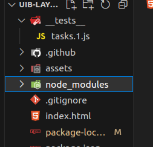
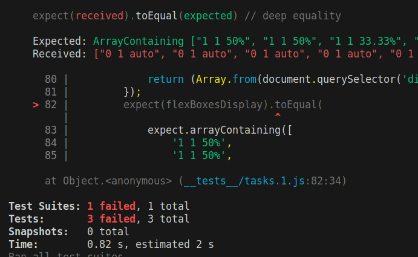
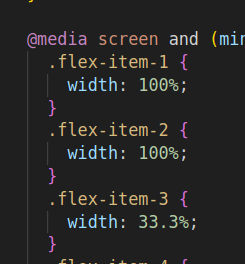

# Testen erledigter Aufgaben mit Jest:

im Terminal in den Aufgaben - Ordner wechseln:

```bash
cd xyz
```

Dort jest installieren mit

```bash
npm install jest
```

das installiert jest in den neuen node_modules - Ordner:



Test Skript aufrufen mit

```bash
npm test
```

und siehe da:

obwohl [diese Aufgabe](./jest-demo/index.html) auf den ersten Blick "richtig" gelöst zu sein schien, war ich zu früh von mir begeistert, denn:



Ursache:



also nach Test Run korrigiert auf:

```css
@media screen and (min-width: 601px) and (max-width: 800px) {
  .flex-item-1 {
    /* width: 100%; */
    flex: 1 1 100%;
  }
  .flex-item-2 {
    /* width: 100%; */
    flex: 1 1 100%;
  }
  .flex-item-3 {
    /* width: 33.3%; */
    flex: 1 1 33.3%;
  }
  .flex-item-4 {
    /* width: 33.3%; */
    flex: 1 1 33.3%;
  }
  .flex-item-5 {
    /* width: 33.3%; */
    flex: 1 1 33.3%;
  }
  .flex-item-6 {
    /* width: 100%; */
    flex: 1 1 100%;
  }
  .flex-item-7 {
    /* width: 100%; */
    flex: 1 1 100%;
  }
}
```

---

[Jest: Leitfaden zum JavaScript-Testing](./jest_de.md)

[Jest Befehle](./jest-befehle.md)

---

[Jest: A Guide to JavaScript Testing](./jest.md)

[Jest Commands](./jest-commands.md)

---
